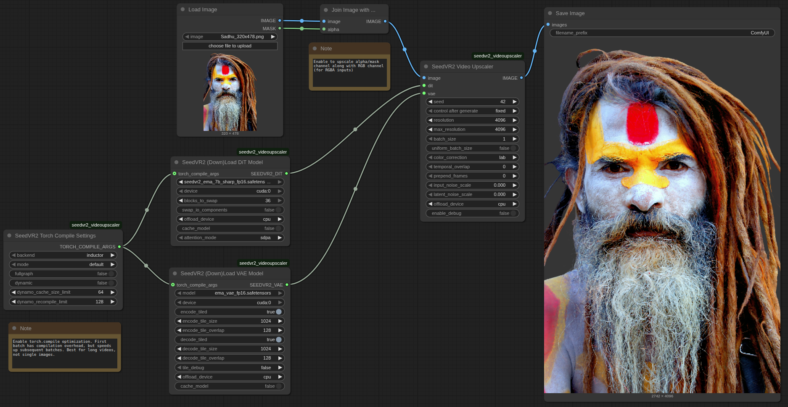

# ComfyUI-SeedVR2_VideoUpscaler

[](https://github.com/numz/ComfyUI-SeedVR2_VideoUpscaler)

Official release of [SeedVR2](https://github.com/ByteDance-Seed/SeedVR) for ComfyUI that enables high-quality video and image upscaling.

Can run as **Multi-GPU standalone CLI** too, see [🖥️ Run as Standalone](#️-run-as-standalone-cli) section.




## 📋 Quick Access

- [🆙 Future Releases](#-future-releases)
- [🚀 Updates](#-updates)
- [🎯 Features](#-features)
- [🔧 Requirements](#-requirements)
- [📦 Installation](#-installation)
- [📖 Usage](#-usage)
- [🖥️ Run as Standalone](#️-run-as-standalone-cli)
- [⚠️ Limitations](#️-limitations)
- [🤝 Contributing](#-contributing)
- [🙏 Credits](#-credits)
- [📜 License](#-license)

## 🆙 Future Releases

We're actively working on improvements and new features. To stay informed:

- **📌 Track Active Development**: Visit [Issues](https://github.com/numz/ComfyUI-SeedVR2_VideoUpscaler/issues) to see active development, report bugs, and request new features
- **💬 Join the Community**: Learn from others, share your workflows, and get help in the [Discussions](https://github.com/numz/ComfyUI-SeedVR2_VideoUpscaler/discussions)
- **🔮 Next Model Survey**: We're looking for community input on the next open-source super-powerful generic restoration model. Share your suggestions in [Issue #164](https://github.com/numz/ComfyUI-SeedVR2_VideoUpscaler/issues/164)

## 🚀 Updates

**2025.11.05**

- 


**2025.08.07**

- 🎯 **Unified Debug System**: New structured logging with categories, timers, and memory tracking. `enable_debug` now available on main node
- ⚡ **Smart FP8 Optimization**: FP8 models now keep native FP8 storage, converting to BFloat16 only for arithmetic - faster and more memory efficient than FP16
- 📦 **Model Registry**: Multi-repo support (numz/ & AInVFX/), auto-discovery of user models, added mixed FP8 variants to fix 7B artifacts
- 💾 **Model Caching**: `cache_model` moved to main node, fixed memory leaks with proper RoPE/wrapper cleanup
- 🧹 **Code Cleanup**: New modular structure (`constants.py`, `model_registry.py`, `debug.py`), removed legacy code
- 🚀 **Performance**: Better memory management with `torch.cuda.ipc_collect()`, improved RoPE handling

**2025.07.17**

- 🛠️ Add 7B sharp Models: add 2 new 7B models with sharpen output

**2025.07.11**

- 🎬 Complete tutorial released: Adrien from [AInVFX](https://www.youtube.com/@AInVFX) created an in-depth ComfyUI SeedVR2 guide covering everything from basic setup to advanced BlockSwap techniques for running on consumer GPUs. Perfect for understanding memory optimization and upscaling of image sequences with alpha channel! [Watch the tutorial](#-usage)

**2025.09.07**

- 🛠️ Blockswap Integration: Big thanks to [Adrien Toupet](https://github.com/adrientoupet) from [AInVFX](https://www.youtube.com/@AInVFX) for this :), useful for low VRAM users (see [usage](#-usage) section)

**2025.07.03**

- 🛠️ Can run as **standalone mode** with **Multi GPU** see [🖥️ Run as Standalone](#️-run-as-standalone-cli)

**2025.06.30**

- 🚀 Speed Up the process and less VRAM used
- 🛠️ Fixed memory leak on 3B models
- ❌ Can now interrupt process if needed
- ✅ Refactored the code for better sharing with the community, feel free to propose pull requests
- 🛠️ Removed flash attention dependency (thanks to [luke2642](https://github.com/Luke2642) !!)

**2025.06.24**

- 🚀 Speed up the process until x4

**2025.06.22**

- 💪 FP8 compatibility !
- 🚀 Speed Up all Process
- 🚀 less VRAM consumption (Stay high, batch_size=1 for RTX4090 max, I'm trying to fix that)
- 🛠️ Better benchmark coming soon

**2025.06.20**

- 🛠️ Initial push

## 🎯 Features

### Core Capabilities
- **High-Quality Diffusion-Based Upscaling**: One-step diffusion model for video and image enhancement
- **Temporal Consistency**: Maintains coherence across video frames with configurable batch processing
- **Multi-Format Support**: Handles RGB and RGBA (alpha channel) for both videos and images
- **Any Video Length**: Suitable for any video length

### Model Support
- **Multiple Model Variants**: 3B and 7B parameter models with different precision options
- **FP16, FP8, and GGUF Quantization**: Choose between full precision (FP16), mixed precision (FP8), or heavily quantized GGUF models for different VRAM requirements
- **Automatic Model Downloads**: Models are automatically downloaded from HuggingFace on first use

### Memory Optimization
- **BlockSwap Technology**: Dynamically swap transformer blocks between GPU and CPU memory to run large models on limited VRAM
- **VAE Tiling**: Process large resolutions with tiled encoding/decoding to reduce VRAM usage
- **Intelligent Offloading**: Offload models and intermediate tensors to CPU or secondary GPUs between processing phases
- **GGUF Quantization Support**: Run models with 4-bit or 8-bit quantization for extreme VRAM savings

### Performance Features
- **torch.compile Integration**: Optional 20-40% DiT speedup and 15-25% VAE speedup with PyTorch 2.0+ compilation
- **Multi-GPU CLI**: Distribute workload across multiple GPUs with automatic temporal overlap blending
- **Model Caching**: Keep models loaded in memory for faster batch processing
- **Flexible Attention Backends**: Choose between PyTorch SDPA (stable, always available) or Flash Attention 2 (faster on supported hardware)

### Quality Control
- **Advanced Color Correction**: Five methods including LAB (recommended for highest fidelity), wavelet, wavelet adaptive, HSV, and AdaIN
- **Noise Injection Controls**: Fine-tune input and latent noise scales for artifact reduction at high resolutions
- **Configurable Resolution Limits**: Set target and maximum resolutions with automatic aspect ratio preservation

### Workflow Features
- **ComfyUI Integration**: Four dedicated nodes for complete control over the upscaling pipeline
- **Standalone CLI**: Command-line interface for batch processing and automation
- **Debug Logging**: Comprehensive debug mode with memory tracking, timing information, and processing details
- **Progress Reporting**: Real-time progress updates during processing

## 🔧 Requirements

### Hardware

With the current optimizations (tiling, BlockSwap, GGUF quantization), SeedVR2 can run on a wide range of hardware:

- **Minimal VRAM** (8GB or less): Use GGUF Q4_K_M models with BlockSwap and VAE tiling enabled
- **Moderate VRAM** (12-16GB): Use FP8 models with BlockSwap or VAE tiling as needed
- **High VRAM** (24GB+): Use FP16 models for best quality and speed without memory optimizations

### Software

- **ComfyUI**: Latest version recommended
- **Python**: 3.12+ (Python 3.12 and 3.13 tested and recommended)
- **PyTorch**: 2.0+ for torch.compile support (optional but recommended)
- **Triton**: Required for torch.compile with inductor backend (optional)
- **Flash Attention 2**: Provides faster attention computation on supported hardware (optional, falls back to PyTorch SDPA)

## 📦 Installation

### Option 1: ComfyUI Manager (Recommended)

1. Open ComfyUI Manager in your ComfyUI interface
2. Click "Custom Nodes Manager"
3. Search for "ComfyUI-SeedVR2_VideoUpscaler"
4. Click "Install" and restart ComfyUI

**Registry Link**: [ComfyUI Registry - SeedVR2 Video Upscaler](https://registry.comfy.org/nodes/seedvr2_videoupscaler)

### Option 2: Manual Installation

1. **Clone the repository** into your ComfyUI custom nodes directory:
```bash
cd ComfyUI
git clone https://github.com/numz/ComfyUI-SeedVR2_VideoUpscaler.git custom_nodes/ComfyUI-SeedVR2_VideoUpscaler
```

2. **Install dependencies using standalone Python**:
```bash
# Install requirements (from same ComfyUI directory)
# Windows:
.venv\Scripts\python.exe -m pip install -r custom_nodes\ComfyUI-SeedVR2_VideoUpscaler\requirements.txt
# Linux/macOS:
.venv/bin/python -m pip install -r custom_nodes/ComfyUI-SeedVR2_VideoUpscaler/requirements.txt
```

3. **Restart ComfyUI**

### Model Installation

Models will be **automatically downloaded** on first use and saved to `ComfyUI/models/SEEDVR2`.

You can also manually download models from:
- Main models available at [numz/SeedVR2_comfyUI](https://huggingface.co/numz/SeedVR2_comfyUI/tree/main) and [AInVFX/SeedVR2_comfyUI](https://huggingface.co/AInVFX/SeedVR2_comfyUI/tree/main)
- Additional GGUF models available at [cmeka/SeedVR2-GGUF](https://huggingface.co/cmeka/SeedVR2-GGUF/tree/main)

## 📖 Usage

### 🎬 Video Tutorials

#### Latest Version Deep Dive (Recommended)

Complete walkthrough of the latest version showing all nodes and functionalities, by the developer behind the integration:

**[Coming Soon]** - A comprehensive tutorial covering the November 2025 update will be released shortly, featuring:
- All four SeedVR2 nodes and their configuration
- GGUF model usage for low VRAM systems
- torch.compile optimization setup
- VAE tiling configuration
- Multi-GPU CLI workflows
- Real-world production tips

#### Previous Version Tutorial

Learn everything about SeedVR2 in this comprehensive tutorial by Adrien from [AInVFX](https://www.youtube.com/@AInVFX), covering ComfyUI setup, BlockSwap for consumer GPUs, alpha workflows, and production tips:

[](https://youtu.be/I0sl45GMqNg)

*Note: This tutorial covers the previous node architecture. The core concepts remain valid, but the UI and some node configurations have changed in the latest version.*

### Node Setup

SeedVR2 uses a modular node architecture with four specialized nodes:

#### 1. SeedVR2 (Down)Load DiT Model

Configure the DiT (Diffusion Transformer) model for video upscaling.

**Parameters:**

- **model**: Choose your DiT model
  - **3B Models**: Faster, lower VRAM requirements
    - `seedvr2_ema_3b_fp16.safetensors`: FP16 (best quality)
    - `seedvr2_ema_3b_fp8_e4m3fn.safetensors`: FP8 8-bit (good quality)
    - `seedvr2_ema_3b-Q4_K_M.gguf`: GGUF 4-bit quantized (acceptable quality)
    - `seedvr2_ema_3b-Q8_0.gguf`: GGUF 8-bit quantized (good quality)
  - **7B Models**: Higher quality, higher VRAM requirements
    - `seedvr2_ema_7b_fp16.safetensors`: FP16 (best quality)
    - `seedvr2_ema_7b_fp8_e4m3fn_mixed_block35_fp16.safetensors`: FP8 with last block in FP16 to reduce artifacts (good quality)
    - `seedvr2_ema_7b-Q4_K_M.gguf`: GGUF 4-bit quantized (acceptable quality)
    - `seedvr2_ema_7b_sharp_*`: Sharp variants for enhanced detail

- **device**: GPU device for DiT inference (e.g., `cuda:0`)

- **offload_device** (optional): Device to offload DiT model when not actively processing
  - `none`: Keep model on inference device (fastest, highest VRAM)
  - `cpu`: Offload to system RAM (reduces VRAM)
  - `cuda:X`: Offload to another GPU (good balance if available)

- **cache_model** (optional): Keep DiT model loaded on offload_device between workflow runs
  - Useful for batch processing to avoid repeated loading
  - Requires offload_device to be set

- **blocks_to_swap** (optional): BlockSwap memory optimization
  - `0`: Disabled (default)
  - `1-32`: Number of transformer blocks to swap for 3B model
  - `1-36`: Number of transformer blocks to swap for 7B model
  - Higher values = more VRAM savings but slower processing
  - Requires offload_device to be set and different from device

- **swap_io_components** (optional): Offload input/output embeddings and normalization layers
  - Additional VRAM savings when combined with blocks_to_swap
  - Requires offload_device to be set and different from device

- **attention_mode** (optional): Attention computation backend
  - `sdpa`: PyTorch scaled_dot_product_attention (default, stable, always available)
  - `flash_attn`: Flash Attention 2 (faster on supported hardware, requires flash-attn package)

- **torch_compile_args** (optional): Connect to SeedVR2 Torch Compile Settings node for 20-40% speedup

**BlockSwap Explained:**

BlockSwap enables running large models on GPUs with limited VRAM by dynamically swapping transformer blocks between GPU and CPU memory during inference. Here's how it works:

- **What it does**: Keeps only the currently-needed transformer blocks on the GPU, while storing the rest on CPU or another device
- **When to use it**: When you get OOM (Out of Memory) errors during the upscaling phase
- **How to configure**:
  1. Set `offload_device` to `cpu` or another GPU
  2. Start with `blocks_to_swap=16` (half the blocks)
  3. If still getting OOM, increase to 24 or 32 (3B) / 36 (7B)
  4. Enable `swap_io_components` for maximum VRAM savings
  5. If you have plenty of VRAM, decrease or set to 0 for faster processing

**Example Configuration for Low VRAM (8GB)**:
- model: `seedvr2_ema_3b-Q8_0.gguf`
- device: `cuda:0`
- offload_device: `cpu`
- blocks_to_swap: `32`
- swap_io_components: `True`

#### 2. SeedVR2 (Down)Load VAE Model

Configure the VAE (Variational Autoencoder) model for encoding/decoding video frames.

**Parameters:**

- **model**: VAE model selection
  - `ema_vae_fp16.safetensors`: Default and recommended

- **device**: GPU device for VAE inference (e.g., `cuda:0`)

- **offload_device** (optional): Device to offload VAE model when not actively processing
  - `none`: Keep model on inference device (default, fastest)
  - `cpu`: Offload to system RAM (reduces VRAM)
  - `cuda:X`: Offload to another GPU (good balance if available)

- **cache_model** (optional): Keep VAE model loaded on offload_device between workflow runs
  - Requires offload_device to be set

- **encode_tiled** (optional): Enable tiled encoding to reduce VRAM usage during encoding phase
  - Enable if you see OOM errors during the "Encoding" phase in debug logs

- **encode_tile_size** (optional): Encoding tile size in pixels (default: 1024)
  - Applied to both height and width
  - Lower values reduce VRAM but may increase processing time

- **encode_tile_overlap** (optional): Encoding tile overlap in pixels (default: 128)
  - Reduces visible seams between tiles

- **decode_tiled** (optional): Enable tiled decoding to reduce VRAM usage during decoding phase
  - Enable if you see OOM errors during the "Decoding" phase in debug logs

- **decode_tile_size** (optional): Decoding tile size in pixels (default: 1024)

- **decode_tile_overlap** (optional): Decoding tile overlap in pixels (default: 128)

- **torch_compile_args** (optional): Connect to SeedVR2 Torch Compile Settings node for 15-25% speedup

**VAE Tiling Explained:**

VAE tiling processes large resolutions in smaller tiles to reduce VRAM requirements. Here's how to use it:

1. **Run without tiling first** and monitor the debug logs (enable `enable_debug` on main node)
2. **If OOM during "Encoding" phase**:
   - Enable `encode_tiled`
   - If still OOM, reduce `encode_tile_size` (try 768, 512, etc.)
3. **If OOM during "Decoding" phase**:
   - Enable `decode_tiled`
   - If still OOM, reduce `decode_tile_size`
4. **Adjust overlap** (default 128) if you see visible seams in output (increase it) or processing times are too slow (decrease it).

**Example Configuration for High Resolution (4K)**:
- encode_tiled: `True`
- encode_tile_size: `1024`
- encode_tile_overlap: `128`
- decode_tiled: `True`
- decode_tile_size: `1024`
- decode_tile_overlap: `128`

#### 3. SeedVR2 Torch Compile Settings (Optional)

Configure torch.compile optimization for 20-40% DiT speedup and 15-25% VAE speedup.

**Requirements:**
- PyTorch 2.0+
- Triton (for inductor backend)

**Parameters:**

- **backend**: Compilation backend
  - `inductor`: Full optimization with Triton kernel generation and fusion (recommended)
  - `cudagraphs`: Lightweight wrapper using CUDA graphs, no kernel optimization

- **mode**: Optimization level (compilation time vs runtime performance)
  - `default`: Fast compilation with good speedup (recommended for development)
  - `reduce-overhead`: Lower overhead, optimized for smaller models
  - `max-autotune`: Slowest compilation, best runtime performance (recommended for production)
  - `max-autotune-no-cudagraphs`: Like max-autotune but without CUDA graphs

- **fullgraph**: Compile entire model as single graph without breaks
  - `False`: Allow graph breaks for better compatibility (default, recommended)
  - `True`: Enforce no breaks for maximum optimization (may fail with dynamic shapes)

- **dynamic**: Handle varying input shapes without recompilation
  - `False`: Specialize for exact input shapes (default)
  - `True`: Create dynamic kernels that adapt to shape variations (enable when processing different resolutions or batch sizes)

- **dynamo_cache_size_limit**: Max cached compiled versions per function (default: 64)
  - Higher = more memory, lower = more recompilation

- **dynamo_recompile_limit**: Max recompilation attempts before falling back to eager mode (default: 128)
  - Safety limit to prevent compilation loops

**Usage:**
1. Add this node to your workflow
2. Connect its output to the `torch_compile_args` input of DiT and/or VAE loader nodes
3. First run will be slow (compilation), subsequent runs will be much faster

**When to use:**
- torch.compile only makes sense when processing **multiple batches, long videos, or many tiles**
- For single images or short clips, the compilation time outweighs the speed improvement
- Best suited for batch processing workflows or long videos

**Recommended Settings:**
- For development/testing: `mode=default`, `backend=inductor`, `fullgraph=False`
- For production: `mode=max-autotune`, `backend=inductor`, `fullgraph=False`

#### 4. SeedVR2 Video Upscaler (Main Node)

Main upscaling node that processes video frames using DiT and VAE models.

**Required Inputs:**

- **image**: Input video frames as image batch (RGB or RGBA format)
- **dit**: DiT model configuration from SeedVR2 (Down)Load DiT Model node
- **vae**: VAE model configuration from SeedVR2 (Down)Load VAE Model node

**Parameters:**

- **seed**: Random seed for reproducible generation (default: 42)
  - Same seed with same inputs produces identical output

- **new_resolution**: Target resolution for shortest edge in pixels (default: 1080)
  - Maintains aspect ratio automatically

- **max_resolution** (optional): Maximum resolution for any edge (default: 0 = no limit)
  - Automatically scales down if exceeded to prevent OOM

- **batch_size**: Frames per batch (default: 5)
  - **CRITICAL REQUIREMENT**: Must follow the **4n+1 formula** (1, 5, 9, 13, 17, 21, 25, ...)
  - **Why this matters**: The model uses these frames for temporal consistency calculations
  - **Minimum 5 for temporal consistency**: Use 1 only for single images or when temporal consistency isn't needed
  - **Match shot length ideally**: For best results, set batch_size to match your shot length (e.g., batch_size=21 for a 20-frame shot)
  - **VRAM impact**: Higher batch_size = better quality and speed but requires more VRAM
  - **If you get OOM with batch_size=5**: Try optimization techniques first (model offloading, BlockSwap, GGUF models...) before reducing batch_size or input resolution, as these directly impact quality

- **temporal_overlap** (optional): Overlapping frames between batches (default: 0)
  - Used for blending between batches to reduce temporal artifacts
  - Range: 0-16 frames

- **prepend_frames** (optional): Frames to prepend (default: 0)
  - Prepends reversed frames to reduce artifacts at video start
  - Automatically removed after processing
  - Range: 0-32 frames

- **color_correction**: Color correction method (default: "wavelet")
  - **`lab`**: Full perceptual color matching with detail preservation (recommended for highest fidelity to original)
  - **`wavelet`**: Frequency-based natural colors, preserves details well
  - **`wavelet_adaptive`**: Wavelet base + targeted saturation correction
  - **`hsv`**: Hue-conditional saturation matching
  - **`adain`**: Statistical style transfer
  - **`none`**: No color correction

- **input_noise_scale** (optional): Input noise injection scale 0.0-1.0 (default: 0.0)
  - Adds noise to input frames to reduce artifacts at very high resolutions
  - Try 0.1-0.3 if you see artifacts with high output resolutions

- **latent_noise_scale** (optional): Latent space noise scale 0.0-1.0 (default: 0.0)
  - Adds noise during diffusion process, can soften excessive detail
  - Use if input_noise doesn't help, try 0.05-0.15

- **offload_device** (optional): Device for storing intermediate tensors between processing phases (default: "cpu")
  - `none`: Keep all tensors on inference device (fastest but highest VRAM)
  - `cpu`: Offload to system RAM (recommended for long videos, slower transfers)
  - `cuda:X`: Offload to another GPU (good balance if available, faster than CPU)

- **enable_debug** (optional): Enable detailed debug logging (default: False)
  - Shows memory usage, timing information, and processing details
  - **Highly recommended** for troubleshooting OOM issues

**Output:**
- Upscaled video frames with color correction applied
- Format (RGB/RGBA) matches input
- Range [0, 1] normalized for ComfyUI compatibility

### Typical Workflow Setup

**Basic Workflow (High VRAM - 24GB+)**:
```
Load Video Frames
    ↓
SeedVR2 Load DiT Model
  ├─ model: seedvr2_ema_3b_fp16.safetensors
  └─ device: cuda:0
    ↓
SeedVR2 Load VAE Model
  ├─ model: ema_vae_fp16.safetensors
  └─ device: cuda:0
    ↓
SeedVR2 Video Upscaler
  ├─ batch_size: 21
  └─ new_resolution: 1080
    ↓
Save Video/Frames
```

**Low VRAM Workflow (8-12GB)**:
```
Load Video Frames
    ↓
SeedVR2 Load DiT Model
  ├─ model: seedvr2_ema_3b-Q8_0.gguf
  ├─ device: cuda:0
  ├─ offload_device: cpu
  ├─ blocks_to_swap: 32
  └─ swap_io_components: True
    ↓
SeedVR2 Load VAE Model
  ├─ model: ema_vae_fp16.safetensors
  ├─ device: cuda:0
  ├─ encode_tiled: True
  └─ decode_tiled: True
    ↓
SeedVR2 Video Upscaler
  ├─ batch_size: 5
  └─ new_resolution: 720
    ↓
Save Video/Frames
```

**High Performance Workflow (24GB+ with torch.compile)**:
```
Load Video Frames
    ↓
SeedVR2 Torch Compile Settings
  ├─ mode: max-autotune
  └─ backend: inductor
    ↓
SeedVR2 Load DiT Model
  ├─ model: seedvr2_ema_7b_sharp_fp16.safetensors
  ├─ device: cuda:0
  └─ torch_compile_args: connected
    ↓
SeedVR2 Load VAE Model
  ├─ model: ema_vae_fp16.safetensors
  ├─ device: cuda:0
  └─ torch_compile_args: connected
    ↓
SeedVR2 Video Upscaler
  ├─ batch_size: 81
  └─ new_resolution: 1080
    ↓
Save Video/Frames
```

## 🖥️ Run as Standalone (CLI)

The standalone CLI provides powerful batch processing capabilities with multi-GPU support and sophisticated optimization options.

### Prerequisites

Choose the appropriate setup based on your installation:

#### Option 1: Already Have ComfyUI with SeedVR2 Installed

If you've already installed SeedVR2 as part of ComfyUI (via [ComfyUI installation](#-installation)), you can use the CLI directly:

```bash
# Navigate to your ComfyUI directory
cd ComfyUI

# Run the CLI using standalone Python (display help message)
# Windows:
.venv\Scripts\python.exe custom_nodes\ComfyUI-SeedVR2_VideoUpscaler\inference_cli.py --help
# Linux/macOS:
.venv/bin/python custom_nodes/ComfyUI-SeedVR2_VideoUpscaler/inference_cli.py --help
```

**Skip to [Command Line Usage](#command-line-usage) below.**

#### Option 2: Standalone Installation (Without ComfyUI)

If you want to use the CLI without ComfyUI installation, follow these steps:

1. **Install [uv](https://docs.astral.sh/uv/getting-started/installation/)** (modern Python package manager):
```bash
# Windows
powershell -ExecutionPolicy ByPass -c "irm https://astral.sh/uv/install.ps1 | iex"

# macOS and Linux
curl -LsSf https://astral.sh/uv/install.sh | sh
```

2. **Clone the repository**:
```bash
git clone https://github.com/numz/ComfyUI-SeedVR2_VideoUpscaler.git ComfyUI-SeedVR2_VideoUpscaler
cd ComfyUI-SeedVR2_VideoUpscaler
```

3. **Create virtual environment and install dependencies**:
```bash
# Create virtual environment with Python 3.13
uv venv --python 3.13

# Activate virtual environment
# Windows:
.venv\Scripts\activate
# Linux/macOS:
source .venv/bin/activate

# Install PyTorch with CUDA support
# Check command line based on your environment: https://pytorch.org/get-started/locally/
uv pip install --pre torch torchvision torchaudio --index-url https://download.pytorch.org/whl/nightly/cu130

# Install SeedVR2 requirements
uv pip install -r requirements.txt

# Run the CLI (display help message)
# Windows:
.venv\Scripts\python.exe inference_cli.py --help
# Linux/macOS:
.venv/bin/python inference_cli.py --help
```

### Command Line Usage

The CLI provides comprehensive options for single-GPU, multi-GPU, and batch processing workflows.

**Basic Usage Examples:**

```bash
# Basic image upscaling
python inference_cli.py --input image.jpg --resolution 720 --model seedvr2_ema_3b_fp8_e4m3fn.safetensors

# Video upscaling with temporal consistency
python inference_cli.py --input video.mp4 --resolution 1080 --batch_size 5

# Memory-optimized for low VRAM (8GB)
python inference_cli.py --input image.png \
    --model seedvr2_ema_3b-Q8_0.gguf \
    --blocks_to_swap 32 \
    --swap_io_components \
    --dit_offload_device cpu

# High resolution with VAE tiling
python inference_cli.py --input video.mp4 \
    --resolution 1440 \
    --max_resolution 3840 \
    --batch_size 21 \
    --vae_encode_tiling_enabled \
    --vae_decode_tiling_enabled

# Multi-GPU processing with temporal overlap
python inference_cli.py --input video.mp4 \
    --cuda_device 0,1 \
    --resolution 1080 \
    --batch_size 81 \
    --temporal_overlap 4 \
    --prepend_frames 2

# Batch directory processing with model caching
python inference_cli.py --input media_folder/ \
    --output processed/ \
    --output_format png \
    --cuda_device 0 \
    --cache_dit \
    --cache_vae \
    --dit_offload_device cpu \
    --vae_offload_device cpu \
    --resolution 1080 \
    --max_resolution 1920

# Performance optimized with torch.compile
python inference_cli.py --input video.mp4 \
    --resolution 1080 \
    --batch_size 45 \
    --compile_dit \
    --compile_vae \
    --compile_mode max-autotune
```

### Command Line Arguments

**Input/Output:**
- `--input`: Input file (.mp4, .avi, .png, .jpg, etc.) or directory (required)
- `--output`: Output path (default: auto-generated in 'output/' directory)
- `--output_format`: Output format: 'mp4' (video) or 'png' (image sequence). Default: auto-detect from input type
- `--model_dir`: Model directory (default: ./models/SEEDVR2)

**Model Selection:**
- `--model`: DiT model to use. Options: 3B/7B with fp16/fp8/GGUF variants (default: 3B FP8)

**Processing Parameters:**
- `--resolution`: Target short-side resolution in pixels (default: 1080)
- `--max_resolution`: Maximum resolution for any edge. Scales down if exceeded. 0 = no limit (default: 0)
- `--batch_size`: Frames per batch (must follow 4n+1: 1, 5, 9, 13, 17, 21...). Ideally matches shot length for best temporal consistency (default: 5)
- `--seed`: Random seed for reproducibility (default: 42)
- `--skip_first_frames`: Skip N initial frames (default: 0)
- `--load_cap`: Load maximum N frames from video. 0 = load all (default: 0)
- `--prepend_frames`: Prepend N reversed frames to reduce start artifacts (auto-removed) (default: 0)
- `--temporal_overlap`: Frames to overlap between batches/GPUs for smooth blending (default: 0)

**Quality Control:**
- `--color_correction`: Color correction method: 'lab' (perceptual, recommended), 'wavelet', 'wavelet_adaptive', 'hsv', 'adain', or 'none' (default: lab)
- `--input_noise_scale`: Input noise injection scale (0.0-1.0). Reduces artifacts at high resolutions (default: 0.0)
- `--latent_noise_scale`: Latent space noise scale (0.0-1.0). Softens details if needed (default: 0.0)

**Memory Management:**
- `--dit_offload_device`: Device to offload DiT model: 'none' (keep on GPU), 'cpu', or 'cuda:X' (default: none)
- `--vae_offload_device`: Device to offload VAE model: 'none', 'cpu', or 'cuda:X' (default: none)
- `--blocks_to_swap`: Number of transformer blocks to swap (0=disabled, 3B: 0-32, 7B: 0-36). Requires dit_offload_device (default: 0)
- `--swap_io_components`: Offload I/O components for additional VRAM savings. Requires dit_offload_device
- `--use_non_blocking`: Use non-blocking memory transfers for BlockSwap (recommended)

**VAE Tiling:**
- `--vae_encode_tiling_enabled`: Enable VAE encode tiling to reduce VRAM during encoding
- `--vae_encode_tile_size`: VAE encode tile size in pixels (default: 1024)
- `--vae_encode_tile_overlap`: VAE encode tile overlap in pixels (default: 128)
- `--vae_decode_tiling_enabled`: Enable VAE decode tiling to reduce VRAM during decoding
- `--vae_decode_tile_size`: VAE decode tile size in pixels (default: 1024)
- `--vae_decode_tile_overlap`: VAE decode tile overlap in pixels (default: 128)
- `--tile_debug`: Visualize tiles: 'false' (default), 'encode', or 'decode'

**Performance Optimization:**
- `--attention_mode`: Attention backend: 'sdpa' (default, stable) or 'flash_attn' (faster, requires package)
- `--compile_dit`: Enable torch.compile for DiT model (20-40% speedup, requires PyTorch 2.0+ and Triton)
- `--compile_vae`: Enable torch.compile for VAE model (15-25% speedup, requires PyTorch 2.0+ and Triton)
- `--compile_backend`: Compilation backend: 'inductor' (full optimization) or 'cudagraphs' (lightweight) (default: inductor)
- `--compile_mode`: Optimization level: 'default', 'reduce-overhead', 'max-autotune', 'max-autotune-no-cudagraphs' (default: default)
- `--compile_fullgraph`: Compile entire model as single graph (faster but less flexible) (default: False)
- `--compile_dynamic`: Handle varying input shapes without recompilation (default: False)
- `--compile_dynamo_cache_size_limit`: Max cached compiled versions per function (default: 64)
- `--compile_dynamo_recompile_limit`: Max recompilation attempts before fallback (default: 128)

**Model Caching (batch processing):**
- `--cache_dit`: Cache DiT model between files (single GPU only, speeds up directory processing)
- `--cache_vae`: Cache VAE model between files (single GPU only, speeds up directory processing)

**Multi-GPU:**
- `--cuda_device`: CUDA device id(s). Single id (e.g., '0') or comma-separated list '0,1' for multi-GPU

**Debugging:**
- `--debug`: Enable verbose debug logging

### Multi-GPU Processing Explained

The CLI's multi-GPU mode automatically distributes the workload across multiple GPUs with intelligent temporal overlap handling:

**How it works:**
1. Video is split into chunks, one per GPU
2. Each GPU processes its chunk independently
3. Chunks overlap by `--temporal_overlap` frames
4. Results are blended together seamlessly using the overlap region

**Example for 2 GPUs with temporal_overlap=4:**
```
GPU 0: Frames 0-50 (includes 4 overlap frames at end)
GPU 1: Frames 46-100 (includes 4 overlap frames at beginning)
Result: Frames 0-100 with smooth transition at frame 48
```

**Best practices:**
- Set `--temporal_overlap` to 2-8 frames for smooth blending
- Higher overlap = smoother transitions but more redundant processing
- Use `--prepend_frames` to reduce artifacts at video start
- batch_size should divide evenly into chunk sizes for best results

## ⚠️ Limitations

### Model Limitations

**Batch Size Constraint**: The model requires batch_size to follow the **4n+1 formula** (1, 5, 9, 13, 17, 21, 25, ...) due to temporal consistency architecture. All frames in a batch are processed together for temporal coherence, then batches can be blended using temporal_overlap. Ideally, set batch_size to match your shot length for optimal quality.

### Performance Considerations

**VAE Bottleneck**: Even with optimized DiT upscaling (BlockSwap, GGUF, torch.compile), the VAE encoding/decoding stages can be the bottleneck, especially for high resolutions. The VAE is slow. Use large batch_size to mitigate this.

**VRAM Usage**: While the integration now supports low VRAM systems (8GB or less with proper optimization), VRAM usage varies based on:
- Input/output resolution (larger = more VRAM)
- Batch size (higher = more VRAM but better temporal consistency and speed)
- Model choice (FP16 > FP8 > GGUF in VRAM usage)
- Optimization settings (BlockSwap, VAE tiling significantly reduce VRAM)

**Speed**: Processing speed depends on:
- GPU capabilities (compute performance, VRAM bandwidth, and architecture generation)
- Model size (3B faster than 7B)
- Batch size (larger batch sizes are faster per frame due to better GPU utilization)
- Optimization settings (torch.compile provides significant speedup)
- Resolution (higher resolutions are slower)

### Best Practices

1. **Start with debug enabled** to understand where VRAM is being used
2. **For OOM errors during encoding**: Enable VAE encode tiling and reduce tile size
3. **For OOM errors during upscaling**: Enable BlockSwap and increase blocks_to_swap
4. **For OOM errors during decoding**: Enable VAE decode tiling and reduce tile size
5. **For best quality**: Use higher batch_size matching your shot length, FP16 models, and LAB color correction
6. **For speed**: Use FP8/GGUF models, enable torch.compile, and use Flash Attention if available
7. **Test settings with a short clip first** before processing long videos

## 🤝 Contributing

Contributions are welcome! We value community input and improvements.

For detailed contribution guidelines, see [CONTRIBUTING.md](CONTRIBUTING.md).

**Quick Start:**

1. Fork the repository
2. Create your feature branch (`git checkout -b feature/AmazingFeature`)
3. Commit your changes (`git commit -m 'Add some AmazingFeature'`)
4. Push to the branch (`git push origin feature/AmazingFeature`)
5. Open a Pull Request to **main** branch for stable features or **nightly** branch for experimental features

**Get Help:**
- YouTube: [AInVFX Channel](https://www.youtube.com/@AInVFX)
- GitHub [Issues](https://github.com/numz/ComfyUI-SeedVR2_VideoUpscaler/issues): For bug reports and feature requests
- GitHub [Discussions](https://github.com/numz/ComfyUI-SeedVR2_VideoUpscaler/discussions): For questions and community support
- Discord: adrientoupet & NumZ#7184

## 🙏 Credits

This ComfyUI implementation is a collaborative project by **[NumZ](https://github.com/numz)** and **[AInVFX](https://www.youtube.com/@AInVFX)** (Adrien Toupet), based on the original [SeedVR2](https://github.com/ByteDance-Seed/SeedVR) by ByteDance Seed Team.

Special thanks to our community contributors including [benjaminherb](https://github.com/benjaminherb), [cmeka](https://github.com/cmeka), [FurkanGozukara](https://github.com/FurkanGozukara), [JohnAlcatraz](https://github.com/JohnAlcatraz), [lihaoyun6](https://github.com/lihaoyun6), [Luchuanzhao](https://github.com/Luchuanzhao), [Luke2642](https://github.com/Luke2642), [naxci1](https://github.com/naxci1), [q5sys](https://github.com/q5sys), and many others for their improvements, bug fixes, and testing.

## 📜 License

The code in this repository is released under the MIT license as found in the [LICENSE](LICENSE) file.